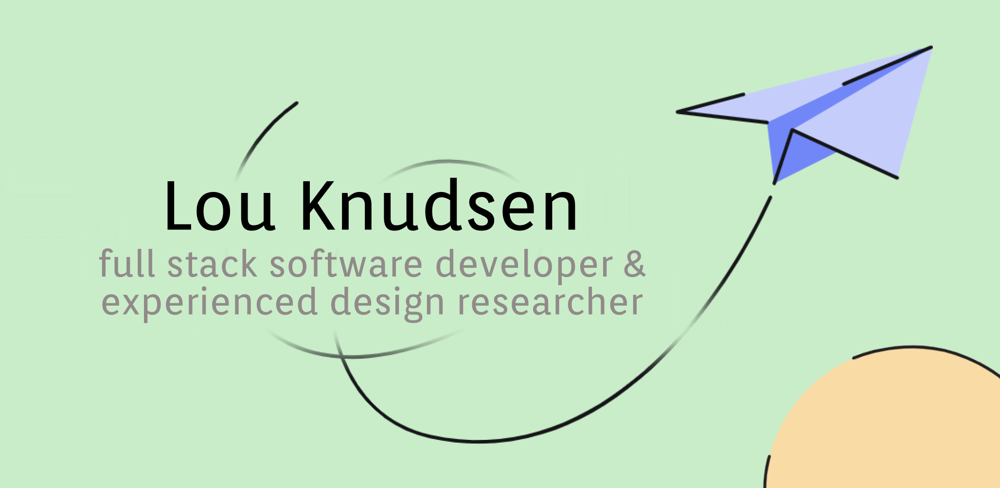
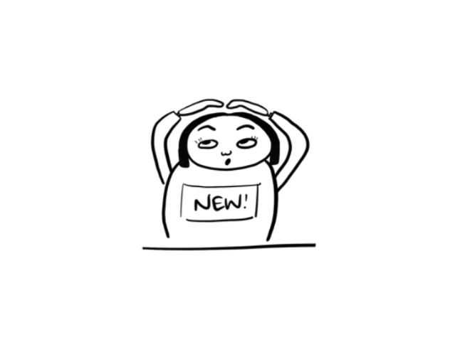

  

Kia Ora, I'm Lou, a Full Stack Developer from the windy city of Wellington, NZ! I'm brand new to the coding world which makes me super excited to be here and just wanting to get my hands on everything.

Recently, I completed a life changing bootcamp for software development and it has really cemented a love of coding.
Some of my coding skills include:  

    
  
  
     
    
  
  
  
  
  

   
   

My main goal right now is just learn from great people, and keep on coding. 

 ---
 
 

  

 
### 🌱 What I'm currently dabbling in...

 
I'm so new to coding that I'm a 'coding magpie' so everything is shiny and exciting! There are so so many things I find I am drawn to. 

 
  Right now I about about to look into three.js, next.js and because in my final project at Devacademy I implemented Material UI -  I'm also keen to look at another SASS design framework.

   

 ---
 
 <h2>
  Group projects tackled at Devacademy:
</h2>

<strong> -- Buddy! -- </strong>
A website that connects people new to Wellington to local Wellingtonians. Using all tech learnt across Devacademy. React, Redux, Redux Thunk, Knex, SQL lite, Typescript, Material UI. 
(https://github.com/lou-knudsen-2023/devacademy-buddy)

<strong>-- Get out of jail! -- </strong>
Super cute starter react game! Completed with location based movement and character changes. It gets odd and the title actually has no reflection on the game itself - but was fun to make! 
(https://github.com/lou-knudsen-2023/devacademy-react-game)

<strong>-- Dev Deals -- </strong>
A community based board specifically for Tech people. Where you can post for buying, selling or general good fun. 
(https://github.com/lou-knudsen-2023/devacademy-dev-deals)

<strong>-- Lost and Found -- </strong>
Creating a place where people can find their lost pets or post found pets. 
(https://github.com/lou-knudsen-2023/devacademy-lost-and-found)

<strong>-- League management -- </strong>
This website was intended for a manager of a league, where they could go in and manage a team of players. 
The stretch challenge on this was to get to trading players between teams - but we didn't quite get there. 
(https://github.com/lou-knudsen-2023/devacademy-league-management)

 ---
 
 <h2>
 I would love to connect!!
</h2>

   

  
  Or you can easily hit me up directly through my email lou.knudsen.nz@gmail.com

